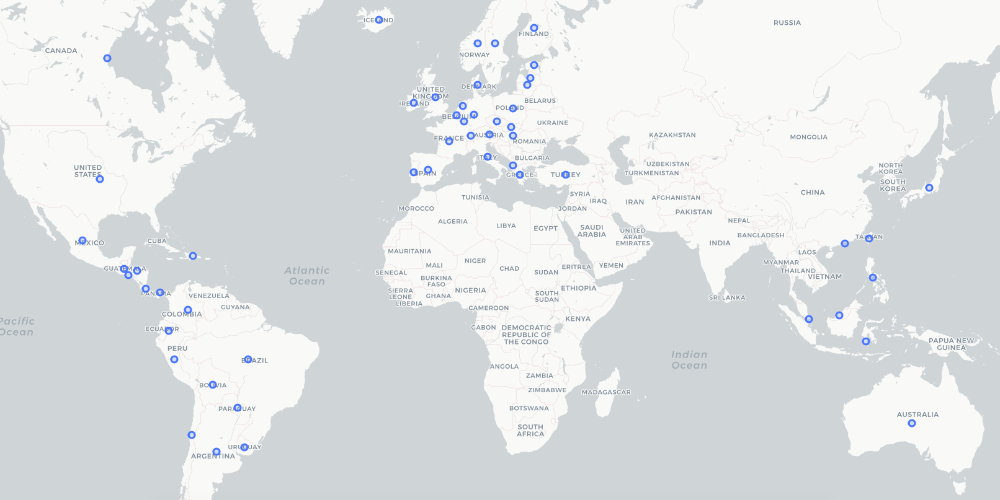
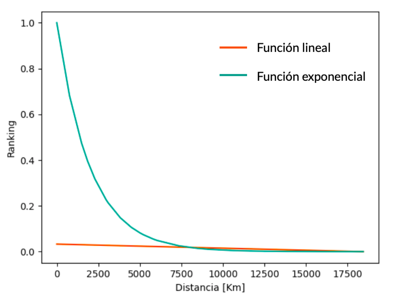

# 2020-Spotify-rank-and-search

Ranking diseñado para canciones de spotify basado en posiciones del top 200, cantidad de reproducciones y distancia a un país de referencia. [Roberto Aguilera, Javiera D. Mizunuma, Rodrigo Fuentes. Grupo 2]

## Idea general

La idea del proyecto es descubrir cómo varían las canciones más populares a través del mundo, tomando en cuenta las posiciones en el [TOP 200 de los rankings de Spotify](https://www.kaggle.com/edumucelli/spotifys-worldwide-daily-song-ranking), la cantidad de reproducciones totales de cada canción en todos los paises donde es escuchada y las distancia de los paises donde estas son reproducidas a uno de referencia.

Analizando esta información esperamos averiguar si existen correlaciones entre el lugar geográfico y la música que más se escucha o si la globalización ha avanzado tanto que lo más popular se ha independizado de la cultura de cada país.

Para esto, se usará los [siguientes datos](./data.zip). Estos están pre procesados para limpiarlos. Los datos sin procesar están [aquí](./raw_data.zip)

Se pretenden seguir lo siguientes pasos:

- Diseñar y calcular un ranking de importancia de las canciones, basado tanto en las posiciones alcanzadas por la canción, como en la cantidad de reproducciones que esta tuvo y las distancias a un pais de referencia.

- Utilizar dicho ranking para crear un índice sobre las canciones del dataset.

- Crear un buscador mediante elastic-search que utilice el indice para entregar resultados acorde al pais de referencia, de tal manera que las canciones más importantes aparezcan primero.

## Data

El Dataset a utilizar es [Spotify’s WorldWide Daily Song Ranking](https://www.kaggle.com/edumucelli/spotifys-worldwide-daily-song-ranking), el cual contiene el ranking diario de las 200 canciones más escuchadas por usuarios en Spotify  en 53 países desde el primero de enero del 2017 hasta el 9 de enero del 2018. Contiene más de 2 millones de filas, que contienen 6629 artistas, 18598 canciones y una cuenta total de 105 billones de reproducciones.

El formato del Dataset es CSV y cada linea se organiza en 7 campos separados por comas (“,”) que contienen los datos en el siguiente orden:

- Posición
- Nombre de la canción
- Artista
- Reproducciones
- URL
- Fecha
- País

Se eligió este Dataset debido a que la música es un gusto afín entre los integrantes del equipo, por lo que les pareció interesante poder utilizar esta información para poder sacar conclusiones sobre las canciones que se escuchan en el mundo, comparando diferentes países y como los resultados de cada uno se pueden relacionar con la cultura de la región.

## Métodos

Lo primero que se hizo fue construir una pequeña visualización de los países de los cuales se tiene información, esto para poder tener una idea de los países con los que se estaba trabajando. Con esto se descubrió que se encuentran la mayoría de los países de América y Europa, y de parte de los de Asia y Oceanía, de otros continentes no se tiene información. Esto ayudó a después decidir con qué países de referencia se trabajaría. El mapa obtenido se muestra a continuación.

El siguiente paso es preprocesar los datos. El formato csv del dataset produce problemas al momento de trabajarlo, pues mucha canciones contienen comas en sus nombres, por ejemplo, "Sola (Remix) [feat. Daddy Yankee, Wisin, Farruko, Zion & Lennox]". Esto causa que al hacer “split”, no todas las filas tengan la misma cantidad de columnas. Para solucionarlo, se crea un [script de Python](./preprocess/clean_commas.py), con el cual se remueven todas las comas que estén dentro de un par de paréntesis o entre comillas, pues ese era el formato en que aparecen la mayoría de los featurings entre artistas. Además de las comas, otro problema encontrado en el dataset original es la existencia del ranking diario global, el cual se obtiene sumando las reproducciones totales por país de cada canción. Para efectos del objetivo de este proyecto, esta información altera los resultados, pues para las canciones que salen en este ranking, estaríamos sumando 2 veces todas sus reproducciones diarias, por lo que se opta por removerlos, mediante otro [script](./preprocess/delete_globals.py) en Python.

Luego utilizando Pig se crea un [ranking](./pig_scripts/total_ranking.pig) para todas las canciones del dataset, teniendo en cuenta tanto las reproducciones, las posiciones obtenidas dentro de todos los países y la distancia desde el país de referencia hasta el país más cercano a éste dónde se escuche dicha canción. Para lograrlo se crearon 3 rankings diferentes:

- [Ranking de posiciones](./pig_scripts/positions.pig): Para cada par único canción y artista se obtiene un promedio de todas las posiciones obtenidas por éste en todos los países, sin contar aquellas fechas y regiones donde no estuvo en el top 200. Luego los resultados se normalizan, tal que, la suma de todos los ranking sea 1.

- [Ranking de reproducciones](./pig_scripts/streams.pig): Para cada par único canción y artista se obtiene un promedio de todas las reproducciones obtenidas por éste en todos los países, para luego normalizar estos resultados obteniendo que la suma del ranking para cada canción es igual a 1.
- [Ranking de distancia](./pig_scripts/distances_ranking.pig): En primer lugar se calculan las distancias entre cada pareja de países en el Dataset, utilizando un [script de Python](./distance/distances_scores.py), el cual genera un [archivo tsv](./distance/distances.tsv) que contiene por cada línea un par de países y su distancia respectiva. A continuación se elige un país de referencia, para obtener las distancias entre los 53 países y éste utilizando [un script de Pig](./pig_scripts/distances.pig). Finalmente se asignan los puntajes para cada canción utilizando un [script de Pig](./pig_scripts/distances_ranking.pig) El cual calcula el valor valor del ranking al aplicarle la función exponencial al inverso aditivo de la distancia dividido por 2000 (esto último para evitar que la curva decrezca muy rápido) y normalizando de tal forma que la suma del ranking obtenido para cada canción sea igual a 1. Se utilizó una función exponencial ya que se buscaba castigar fuertemente a los países que estuvieran lejos del país de referencia, a continuación se muestra la diferencia entre la curva exponencial utilizada y la alternativa que hubiera sido lineal.

    

El ranking de cada canción se obtiene al ponderar cada uno de los rankings ya mencionados según la importancia que el grupo asigna a cada dato respecto del objetivo del proyecto. En un principio se piensa en darle la misma relevancia a cada ranking, pero esto no arrojaba datos consistentes. Se llega a la hipótesis de que la cantidad de reproducciones de canciones muy famosas crea un desbalance en el ranking, pues sus números son tan grandes que acaparan los primeros lugares. Por esto se concluye  que es necesario darle una ponderación mucho mayor al ranking de distancias, ya que esto implica darle énfasis a la musica que se escucha localmente en cada país, en lugar de a lo más escuchado a nivel mundial.

Teniendo el ranking listo, solo queda incorporar este a un sistema de búsqueda. Esto se hizo utilizando Elastic Search, basándose en el laboratorio 7 del curso. Primero se construyó un índice de los datos, que considera el artista, el nombre de la canción y el puntaje obtenido según el ranking implementado. Luego, al momento de realizar una búsqueda, se utiliza el ranking incorporado como un boost para ordenar los resultados según su relevancia, los scripts utilizados para esta parte se encuentran en [/java](./java).

Se opta por desarrollar los rankings en pig, puesto que dentro los tópicos vistos en el curso, es lo que más se asemeja a experiencias de cada integrante. Además al tener una sintaxis simple facilita el trabajo a la hora de programar. Para implementar las búsquedas se usa Elastic search, ya que permite aplicar los rankings ya creados mediante un índice de importancia, lo que va de la mano con el objetivo de descubrir si actualmente existe una relación entre la música y los lugares donde es escuchada. 

## Resultados

### Top 10 reproducciones

Las mejores 10 canciones según el ranking, considerando solo las reproducciones.

| Artista | Canción | Puntaje
|---|---|---|
| Jeezy | "American Dream (feat)" | 7.81054960186701E-4
| blackbear | playboy shit (feat. lil aaron) | 6.908964833405943E-4
| Lin-Manuel Miranda | Almost Like Praying (feat. Artists for Puerto Rico) | 6.612622023153749E-4
| Tom Petty and the Heartbreakers | The Waiting | 6.463402417604166E-4
| Tom Petty and the Heartbreakers | Here Comes My Girl | 6.395081817370284E-4
| Gucci Mane | Mall | 6.207740817471856E-4
| G-Eazy | Nothing Wrong | 6.182771580015577E-4
| Bruce Springsteen | Born In The U.S.A. | 6.132634498706992E-4
| Ty Dolla $ign | Lil Favorite (feat. MadeinTYO) | 6.091125761936989E-4
| Gucci Mane | Peepin out the Blinds | 6.01764139540636E-4

### Top 10 posiciones en el top 200

Las mejores 10 canciones según el ranking, considerando solo las posiciones en las que estuvo la canción en algún top 200 en algún país.

| Artista | Canción | Puntaje
|---|---|---|
| KESI | Ligesom Mig | 7.151963511065273E-5
| Pikku G | Solmussa (feat. BEHM) | 7.148351408281907E-5
| Floni | Ungir Strákar - Deep Mix | 7.127528698118972E-5
| Birnir| Já ég veit | 7.120142605592761E-5
| Ezhel | İmkansızım | 7.102464324774698E-5
| Shade | Irraggiungibile (feat. Federica) | 7.095106337623397E-5
| Chase | Ég Vil Það | 7.082862414340004E-5
| Birnir | Út í geim | 7.069996563288884E-5
| Ersay Üner | İki Aşık | 7.052054285142376E-5
| Nitro | Infamity Show | 7.043600427564284E-5

### Top 10 distancia desde Chile

10 de las mejores canciones según el ranking, considerando solo la distancia hacia Chile (Por eso todas tienen el mismo puntaje).

| Artista | Canción | Puntaje
|---|---|---|
| "Franco ""El Gorilla""" | Bailen (Remix) | 6.108237711118094E-4
| Michael Bublé | Christmas (Baby Please Come Home) | 6.108237711118094E-4
| Sam Smith | Stay With Me | 6.108237711118094E-4
| Sonora Malecón | Melosa | 6.108237711118094E-4
| Maroon 5 | Don't Wanna Know (feat. Kendrick Lamar) | 6.108237711118094E-4
| Demi Lovato | Sorry Not Sorry | 6.108237711118094E-4
| Sia | Cheap Thrills | 6.108237711118094E-4
| Luis Miguel | Llego La Navidad (Winter Wonderland) | 6.108237711118094E-4
| Alessia Cara | "How Far I'll Go - From ""Moana""" | 6.108237711118094E-4
| Soundgarden | Rusty Cage | 6.108237711118094E-4

### Top 10 Chile

Las mejores 10 canciones según el ranking, considerando las reproducciones, posiciones y además la distancia a Chile.

| Artista | Canción | Puntaje
|---|---|---|
| Anitta | Vai malandra (feat. Tropkillaz e DJ Yuri Martins) | 5.130947105517517E-4
| Post Malone | rockstar | 4.811787550831518E-4
| Major Lazer | Sua Cara (feat. Anitta & Pabllo Vittar) | 4.6946842840846036E-4
| Ed Sheeran | Shape of You | 4.6914858217336595E-4
| Soundgarden | Burden In My Hand | 4.687756220883004E-4
| Luis Fonsi | Despacito - Remix | 4.670383870550586E-4
| Drake | Free Smoke | 4.649374689773587E-4
| Eminem | River (feat. Ed Sheeran) | 4.64760046748282E-4
| Camila Cabello | Havana | 4.63292588251183E-4
| Sam Smith | Too Good At Goodbyes - Edit | 4.632317596483783E-4

### Top 10 Estados Unidos

Las mejores 10 canciones según el ranking, considerando las reproducciones, posiciones y además la distancia a Estados Unidos.

| Artista | Canción | Puntaje
|---|---|---|
| Jeezy | "American Dream (feat)" | 4.4669041787373076E-4
| blackbear | playboy shit (feat. lil aaron) | 4.286587225045094E-4
| Lin-Manuel Miranda | Almost Like Praying (feat. Artists for Puerto Rico) | 4.220455667706259E-4
| Tom Petty and the Heartbreakers | The Waiting | 4.190972956874679E-4
| Tom Petty and the Heartbreakers | Here Comes My Girl | 4.1758639957145563E-4
| G-Eazy | Nothing Wrong | 4.142793415480367E-4
| Bruce Springsteen | Born In The U.S.A. | 4.134210840331997E-4
| Gucci Mane | Mall | 4.12882372335895E-4
| Ty Dolla $ign | Lil Favorite (feat. MadeinTYO) | 4.1157952051845703E-4
| Gucci Mane | Peepin out the Blinds | 4.0879141567191576E-4

### Top 10 Alemania

Las mejores 10 canciones según el ranking, considerando las reproducciones, posiciones y además la distancia a Alemania.

| Artista | Canción | Puntaje
|---|---|---|
| Kodak Black | Roll In Peace (feat. XXXTENTACION) | 1.7034891512072943E-4
| Bausa | Was Du Liebe nennst | 1.681157227647236E-4
| Jeezy | "American Dream (feat)" | 1.618733774544751E-4
| Lil Uzi Vert | Two® | 1.6124564313384928E-4
| Lil Uzi Vert | Sauce It Up | 1.6100463497160415E-4
| Lil Uzi Vert | 444+222 | 1.6070118322090087E-4
| Future | Rent Money | 1.5871443221579512E-4
| Big Sean | Go Legend (& Metro Boomin) | 1.519541938807858E-4
| Big Sean | Jump Out The Window | 1.5107802220292295E-4
| 6ix9ine | GUMMO | 1.495800024531379E-4

### Top 10 Honk Kong

Las mejores 10 canciones según el ranking, considerando las reproducciones, posiciones y además la distancia a Honk Kong.

| Artista | Canción | Puntaje
|---|---|---|
| Chance The Rapper | Juke Jam (feat. Justin Bieber & Towkio) | 2.805433439128051E-4
| Thomas Rhett | Craving You | 2.712499973652033E-4
| Thomas Rhett | Unforgettable | 2.7101247128423055E-4
| Post Malone | rockstar | 2.611522114399616E-4
| Kodak Black | Codeine Dreaming (feat. Lil Wayne) | 2.5626585629821906E-4
| Lil Uzi Vert | The Way Life Goes (feat. Nicki Minaj & Oh Wonder) - Remix | 2.5515132538361584E-4
| Miguel | Sky Walker | 2.524229079884676E-4
| Drake | Gyalchester | 2.5167145357289785E-4
| Drake | Sacrifices | 2.5097445897865884E-4
| Kendrick Lamar | LOVE. FEAT. ZACARI. | 2.5025404920979194E-4

### Búsquedas

Búsqueda desde Chile 🇨🇱, sin utilizar el ranking, para la palabra "mon":

| Artista | Canción |
|---|---|
| Hornet La Frappe | Mon ex
| Fouli | Mon Poto
| Soprano | Mon pr?cieux
| Capo | Mon Ch?ri
| Jul | Mon bijou
| Still Fresh | Mon ami
| Bigflo & Oli | Dans mon lit
| Johnny Hallyday | Mon plus beau No?l
| Mon Laferte | El Diablo
| Mon Laferte | Vuelve por Favor

Búsqueda desde Chile 🇨🇱, utilizando el ranking, para la palabra "mon":

| Artista | Canción |
|---|---|
| Mon Laferte | El Diablo
| Mon Laferte | Vuelve por Favor
| Mon Laferte | El Cristal
| Mon Laferte | Amárrame
| Mon Laferte | Salvador
| Mon Laferte | Un Alma En Pena
| Mon Laferte | La Visita
| Mon Laferte | Malagradecido
| Mon Laferte | Bonita - Bonus Track
| Mon Laferte | Orgasmo para Dos

Búsqueda desde Estados Unidos 🇺🇸, utilizando el ranking, para la palabra "mon":

| Artista | Canción |
|---|---|
| Mon Laferte | Tu Falta De Querer
| Mon Laferte | Amor Completo
| Mon Laferte | Yo Te Qui
| Mon Laferte | Mi Buen Amor
| Mon Laferte | Amárrame
| Mon Laferte | Si Tú Me Quisieras
| Mon Laferte | Primaveral
| Capo | Mon Ch?ri
| Sofiane | Mon p'tit loup
| Roch Voisine | Mon beau sapin

Búsqueda desde Alemania 🇩🇪, utilizando el ranking, para la palabra "mon":

| Artista | Canción |
|---|---|
| Capo | Mon Ch?ri
| Sofiane | Mon p'tit loup
| Soprano | Mon pr?cieux
| Hornet La Frappe | Mon ex
| Fouli | Mon Poto
| DTF | Dans mon nuage
| Still Fresh | Mon ami
| Roch Voisine | Mon beau sapin
| Bigflo & Oli | Dans mon lit
| Jul | Mon bijou

Búsqueda desde Honk Kong 🇭🇰, utilizando el ranking, para la palabra "mon":

| Artista | Canción |
|---|---|
| Capo | Mon Ch?ri
| Sofiane | Mon p'tit loup
| Roch Voisine | Mon beau sapin
| Hornet La Frappe | Mon ex
| Moha La Squale | M'appelle pas mon fr?rot
| Soprano | Mon pr?cieux
| Mon Laferte | Am?rrame
| Mon Laferte | Mi Buen Amor
| Mon Laferte | Tu Falta De Querer
| Johnny Hallyday | Mon plus beau No?l

## Conclusiones

Viendo los resultados, se concluye que algunas partes del ranking funcionaron como se esperaba, pero otras no.

Por ejemplo, el ranking de posiciones no fue bien logrado, y por eso no se ve ninguna canción conocida popularmente, como se esperaría. Las canciones que se ven en este top 10 son canciones que alcanzaron posiciones muy altas durante unos pocos días, causando que su promedio se inflase notoriamente.

Por otro lado, se cree que el ranking de distancia fue logrado, ya que en en Chile efectivamente se pueden ver canciones conocidas por el público general. La única excepción sería la primera (Vai malandra), pero esta es una canción muy popular en Brasil, y como este se encuentra relativamente cerca de Chile y es el séptimo país con más población en el mundo, logra que las canciones que aquí se escuchan lleguen muy alto en el ranking implementado.

En general, a pesar de tener espacio para mejoras, el ranking implementado se considera logrado. Esto se puede observar en los resultados de las búsquedas realizadas. Si se busca "mon" sin utilizar el ranking, se obtienen resultados poco populares para Chile, mientras que al utilizarlo, en las primeras 10 posiciones se obtienen canciones de Mon Laferte, cantante chilena muy popular. Luego, su aparición en las búsquedas desde otros países disminuye, a pesar de ser bastante alta en Estados Unidos, esto ocurre probablemente por su popularidad en México.

Dentro de las mayores dificultades encontradas al realizar el proyecto se encuentran el pre-procesamiento de los datos y la implementación del sistema de búsqueda utilizando Elastic Search considerando el ranking propuesto. El primero fue principalmente debido a que el archivo era un .csv y dentro del nombre de algunas canciones se encontraban comas. Por su lado implementar la búsqueda con Elastic Search fue difícil, pues no se tenía conocimiento de cómo incorporar el ranking implementado a la búsqueda.

Implementar los scripts de pig resultó bastante fácil. La experiencia del laboratorio 3 del ramo, fue una de las principales motivaciones para utilizar esta herramienta, pues éste le resultó al grupo fácil de realizar, debido a que es similar a herramientas que habían sido utilizadas previamente, como SQL.

Si se rehiciera el proyecto, se cambiaría la implementación del ranking de posiciones, el cual no toma en consideración factores importantes como el tiempo que una canción se mantiene dentro del TOP 200, lo que ocasiona que ciertas canciones que tienen breves lapsos de popularidad alcancen posiciones altas en este. Siguiendo esta idea, en lugar de sólo sumar sus apariciones y dividirlas por la cantidad de estas, se debería dividir por el total de días que abarca el ranking o al menos por el máximo que haya alcanzado una canción, de tal manera que esto refleje su consistencia en el tiempo.
